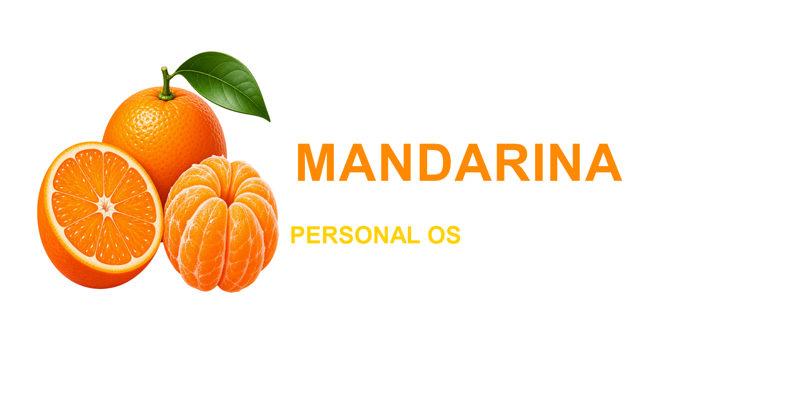
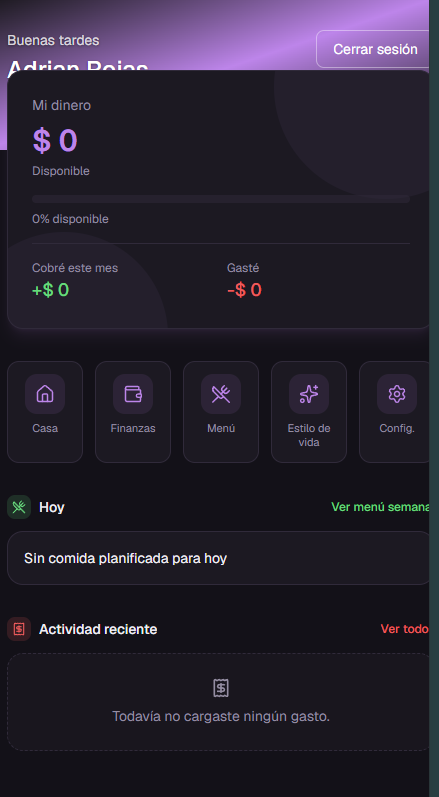

  

# Mandarina Personal OS

Caso de estudio de una aplicación personal que concentra finanzas, hogar, alimentación, bienestar y organización diaria en una experiencia simple y mobile-first.

[Ver producto](https://somosmandarina.vercel.app)

  

## El problema

La información cotidiana suele quedar repartida entre planillas, notas y aplicaciones aisladas. Mandarina propone una vista unificada: qué requiere atención hoy, cómo están las finanzas y cuáles son los próximos pasos.

## Trabajo realizado

- Diseño de producto y arquitectura modular.
- Dashboard personal con indicadores y accesos rápidos.
- Finanzas, presupuestos, movimientos y objetivos.
- Organización del hogar, menú semanal y estilo de vida.
- Autenticación, permisos y aislamiento de datos con Supabase RLS.
- Estados de carga, vacíos, errores y confirmaciones.
- Diseño responsive, PWA y validación automatizada.

## Stack

Next.js 16, React 19, TypeScript, Tailwind CSS, Supabase/PostgreSQL, Server Actions, Vitest, Playwright, Motion, D3 y Vercel.

## Decisiones destacadas

- Separación estricta entre interfaz, lógica de negocio, servicios y base de datos.
- Interfaz basada en tarjetas e indicadores para evitar una experiencia de planilla.
- Acciones frecuentes resueltas con flujos breves y pensados primero para celular.
- Seguridad por usuario en la base de datos, además de los controles de la interfaz.

La implementación operativa se mantiene privada porque administra información personal y financiera. Este repositorio documenta el producto, las decisiones técnicas y las medidas de seguridad sin publicar datos ni credenciales.

Más detalle en [Producto](docs/PRODUCT.md), [Arquitectura](docs/ARCHITECTURE.md) y [Seguridad](docs/SECURITY.md).
